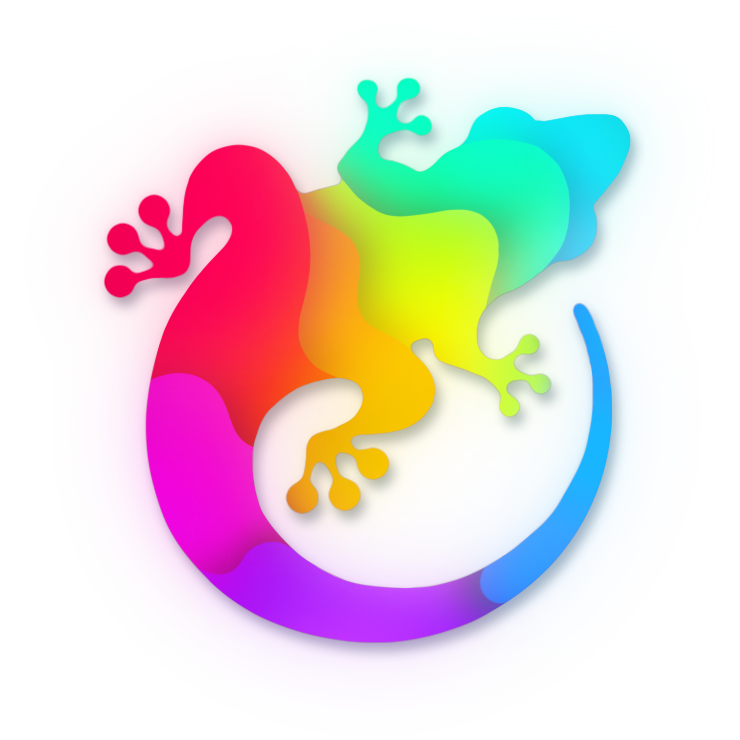

<h1 size=7 align="center">Gekko 0.0.1</h1>
<h4 align="center">Modular User Interface System for GameMaker 2.3+</h4>

<h3 align="center">
  

  The library and the readme is currently under construction, feel free to check out Gekko if you want to.
I'm currently building and fleshing out functionality :)

  You can <a href="https://github.com/JustFredrik/Gekko/releases"> download the .yymps</a> to get started

If you are interested to learn more, ask questions or give feedback please join the <a href="https://discord.com/invite/47ap8cE"> Discord</a>! 
 </h3>

 

  The Gekko library is a versatile and user-friendly UI toolkit for GameMaker 2.3+, designed to streamline the creation of graphical user interfaces in your projects. Built around the concept of components, Gekko supports various visual elements and offers automatic synchronization, anchoring, and event handling capabilities. Tailored for developers of all skill levels, Gekko empowers you to build interactive and responsive UI elements with ease.

 

<h2>The Gekko Component System</h2>

  The Gekko library is built around the concept of components, which are the fundamental elements used to create graphical user interfaces (GUI) in Gekko. Components can represent various visual elements such as text, sprites, nine-slices, and lists, and can be nested and used to create intricate GUI designs.

  To ensure that components maintain their relative positions on the screen regardless of the game's aspect ratio, they can be anchored to specific parts of the screen. Furthermore, Gekko offers global re-scaling capabilities to automatically fit the user interface to the screen, ensuring a uniform appearance across various resolutions. This allows for a consistent layout across various devices and display settings.

  Components also offer the ability to link their properties, such as position and scale, to variables from other structs or instances, enabling automatic synchronization. Additionally, you can define custom callbacks for specific property changes, allowing components to perform actions like shaking when the health decreases or scaling up as health increases.

  Gekko takes care of mouse hovering detection automatically, and it also provides the option to specify custom callbacks for events like clicking on a component. This makes it easy for developers to create interactive and responsive UI elements within their GameMaker projects.

 

 

<h2>Animated Properties</h2>

Gekko offers seamless animation support for component properties, simplifying the process of creating dynamic UI elements. By utilizing the component.set_default_animation_style() function, developers can choose from instant, linear, or spring-based animations for various component properties. This enables effortless animation of attributes like position (x, y), scale, separation, and many more.

Looking to create a responsive, bouncy button with a touch of 'juice'? Simply set the button's scale to increase upon triggering the hover event, and you'll have an engaging, interactive button with just a few lines of code!

